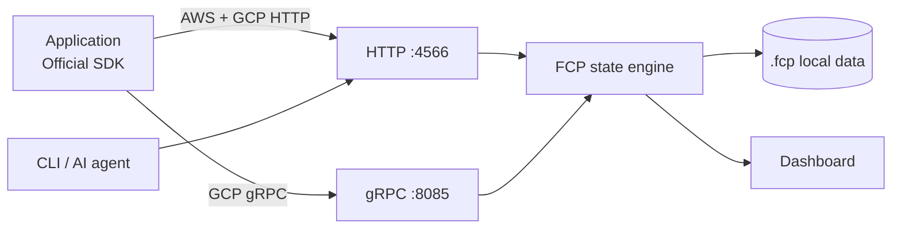

<div align="center">

# FCP

### Fake Cloud Platform

실제 AWS·Google Cloud SDK를 그대로 연결해 사용하는<br />
**로컬 개발 및 통합 테스트용 경량 클라우드 에뮬레이터**

[](https://github.com/devy1540/fcp/actions/workflows/ci.yml)
[](LICENSE)


[빠른 시작](#빠른-시작) · [지원 서비스](#지원-서비스) · [CLI](#ai와-cli) · [신뢰도 기준](#신뢰도-기준) · [호환성 문서](docs/compatibility.md)

</div>

---

애플리케이션 코드는 실제 SDK와 프로토콜을 사용하고, 연결 대상만 FCP로 바꿉니다. 외부 클라우드 없이도 객체 저장, 메시징, 데이터베이스, Secret, 서명, 알림, AI 호출 흐름을 빠르고 반복 가능하게 검증할 수 있습니다.

| 실제 SDK 그대로 | 결정적인 로컬 상태 | 한눈에 보이는 검증 근거 |
|---|---|---|
| AWS·GCP 공식 클라이언트를 endpoint 설정만 바꿔 연결합니다. | 데이터는 `.fcp/`에 저장되고 재시작 후에도 유지됩니다. | 대시보드와 CLI에서 런타임 상태, SDK 검증, `FULL`·`PARTIAL` 범위를 구분합니다. |

## 빠른 시작

### 설치

```bash
go install github.com/devy1540/fcp/cmd/fcp@latest
```

버전 태그가 게시되면 [GitHub Releases](https://github.com/devy1540/fcp/releases)에서 macOS·Linux용 `amd64`/`arm64` 아카이브와 체크섬을 받을 수 있고, `ghcr.io/devy1540/fcp:<version>` 이미지도 함께 게시됩니다.

### 1. FCP 실행

```bash
go run ./cmd/fcp \
  --profile demo \
  --project fcp-local \
  --credentials-out .fcp/fcp-local-credentials.json
```

| endpoint | 용도 |
|---|---|
| `http://127.0.0.1:4566` | AWS API, GCP HTTP API, 관리 API |
| `127.0.0.1:8085` | GCP gRPC API |
| `http://127.0.0.1:4566/_fcp/ui` | 로컬 관리 대시보드 |

### 2. 연결 상태 확인

```bash
go run ./cmd/fcp doctor --json
go run ./cmd/fcp status --json
```

### 3. 애플리케이션 연결

```bash
# AWS
export AWS_ACCESS_KEY_ID=test
export AWS_SECRET_ACCESS_KEY=test
export AWS_REGION=us-east-1
export AWS_ENDPOINT_URL=http://127.0.0.1:4566

# Google Cloud
export STORAGE_EMULATOR_HOST=http://127.0.0.1:4566
export PUBSUB_EMULATOR_HOST=127.0.0.1:8085
export FIRESTORE_EMULATOR_HOST=127.0.0.1:8085
export GOOGLE_CLOUD_PROJECT=fcp-local
```

Provider별 환경 변수는 CLI로 바로 만들 수 있습니다.

```bash
go run ./cmd/fcp env aws --format shell
go run ./cmd/fcp env gcp --format shell
go run ./cmd/fcp env all --format shell
```

## 지원 서비스

FCP는 전체 클라우드 복제가 아니라, 일반적인 로컬 개발과 통합 테스트 흐름을 우선 구현합니다.

| Provider | 서비스 | 연결 방식 |
|---|---|---|
| **AWS** | S3, SQS, DynamoDB, STS | HTTP `:4566` |
| **Google Cloud** | Cloud Storage, FCM, Vertex AI / Gemini, Compute Metadata | HTTP `:4566` |
| **Google Cloud** | Pub/Sub, Firestore, Secret Manager, Cloud KMS, IAM Credentials | gRPC `:8085` |

Secret Manager와 Cloud KMS는 SDK 연결 외에 HTTP/JSON 경로도 제공합니다. 서비스별 API, 검증 범위와 실제 클라우드와의 차이는 [호환성 문서](docs/compatibility.md)에 명시되어 있습니다.

## 동작 구조



- 단일 Go 바이너리에 서버, 대시보드와 Codex Skill을 함께 포함합니다.
- 상태 메타데이터는 JSON으로, 객체 본문과 로컬 키는 데이터 디렉터리에 저장합니다.
- 기본 바인딩은 loopback이며 외부 AWS·GCP 데이터를 가져오지 않습니다.

## 로컬 대시보드

`http://127.0.0.1:4566/_fcp/ui`에서 다음을 확인하고 관리할 수 있습니다.

- AWS와 Google Cloud 서비스별 상태 및 리소스
- 공식 SDK·HTTP 계약 검증 근거와 API별 `FULL`·`PARTIAL` 범위
- SQS, Pub/Sub, FCM 메시지 상태와 Vertex AI 호출 메타데이터
- 버킷, 큐, 테이블, Topic·Subscription 생성 및 안전한 삭제
- 검색, 서버 페이지네이션, 3초 자동 갱신과 `STALE` 상태

대시보드는 Secret payload, DynamoDB 아이템 값, KMS key material, IAM 개인키, 메시지 본문, AI 프롬프트와 생성 결과를 표시하지 않습니다.

## AI와 CLI

조회 명령은 AI 에이전트가 안정적으로 처리할 수 있도록 구조화된 JSON과 고정된 exit code를 제공합니다.

| 명령 | 용도 |
|---|---|
| `fcp doctor --json` | HTTP, 대시보드, GCP gRPC 포트 진단 |
| `fcp status --json` | 프로젝트와 서비스별 리소스 수 조회 |
| `fcp env <aws\|gcp\|all> --format shell` | Provider별 로컬 환경 변수 생성 |
| `fcp resources list --service <id> --json` | 비민감 리소스 메타데이터 검색 및 페이지 조회 |
| `fcp verify --service <id> --json` | 런타임과 선언된 호환성 근거 확인 |
| `fcp verify --strict --json` | 선택 범위에 `PARTIAL`이 있으면 실패 처리 |
| `fcp snapshot list\|save\|load\|delete` | 체크섬이 포함된 로컬 기준 상태 관리 |
| `fcp exec -- <command>` | 임시 포트·데이터 디렉터리에서 테스트 명령 격리 실행 |
| `fcp skill install --json` | Codex용 `fcp-local-cloud` Skill 설치 |

```bash
# Pub/Sub 리소스 검색
go run ./cmd/fcp resources list \
  --provider GCP \
  --service pubsub \
  --query events \
  --limit 25 \
  --json

# GCS 구현 범위 확인
go run ./cmd/fcp verify --service gcs --json

# Codex Skill 설치; 기존 Skill은 덮어쓰지 않음
go run ./cmd/fcp skill install --json
```

Exit code는 성공 `0`, 런타임·검증 실패 `1`, 잘못된 사용법 `2`입니다. `verify`는 SDK 테스트를 새로 실행하거나 실제 클라우드 동등성을 증명하지 않습니다.

## 반복 가능한 테스트 상태

실행 중인 FCP 상태를 이름 있는 기준점으로 저장하고 복원할 수 있습니다. 스냅샷은 상태와 객체 본문의 SHA-256을 검증하며 기존 이름을 자동으로 덮어쓰지 않습니다.

```bash
fcp snapshot save clean --json
fcp snapshot list --json
fcp snapshot load clean --json
fcp snapshot delete clean --json
```

`load`는 현재 로컬 상태를 교체하고 `delete`는 지정한 로컬 스냅샷을 제거합니다. 두 명령은 명시적으로 호출할 때만 수행됩니다.

테스트 한 번만을 위한 FCP는 `exec`로 격리할 수 있습니다. 임의의 loopback 포트와 임시 데이터 디렉터리를 사용하고, 필요한 AWS·Google Cloud 환경 변수를 자식 프로세스에만 주입한 뒤 종료 시 정리합니다.

```bash
fcp exec \
  --snapshot clean \
  --data-dir .fcp \
  --profile demo \
  -- ./gradlew test
```

`exec`는 자식 명령의 종료 코드를 그대로 반환합니다. 스냅샷에는 로컬 Secret payload와 개인키가 포함될 수 있으므로 저장소에 커밋하거나 공유하지 마십시오.

## 데모 프로필

`--profile demo`는 기능을 바로 시험할 수 있는 범용 리소스를 멱등하게 준비합니다.

- `notifications` DynamoDB 테이블
- `notifications`, `scheduled-jobs` SQS 큐
- GCS 버킷과 V4 signed URL용 로컬 IAM 계정
- Pub/Sub Topic, Subscription, DLQ
- 빈 JSON Secret, 로컬 DB Secret, KMS 서명·암호화 키
- FCM 요청 캡처와 결정적인 Vertex AI / Gemini 응답

```bash
go run ./cmd/fcp \
  --profile demo \
  --project fcp-local \
  --credentials-out .fcp/fcp-local-credentials.json

source examples/demo/env.sh
```

MySQL과 Redis도 함께 필요하다면 다음 구성을 사용합니다.

```bash
docker compose up --build
```

Cloud SQL과 Memorystore 제어 API를 흉내 내는 대신, 애플리케이션이 실제 MySQL·Redis 프로토콜로 연결됩니다.

## SDK 연결 예시

### AWS CLI

```bash
aws s3api create-bucket --bucket uploads
aws s3api put-object --bucket uploads --key hello.txt --body ./hello.txt

aws sqs create-queue --queue-name jobs
aws sqs send-message \
  --queue-url http://127.0.0.1:4566/000000000000/jobs \
  --message-body hello

aws sts get-caller-identity
```

S3 SDK가 virtual-hosted style을 기본 사용한다면 `forcePathStyle` 옵션을 활성화하십시오.

### Google Cloud Go SDK

```go
storageClient, _ := storage.NewClient(ctx)
_ = storageClient.Bucket("assets").Create(ctx, "fcp-local", nil)

pubsubClient, _ := pubsub.NewClient(ctx, "fcp-local")
_, _ = pubsubClient.TopicAdminClient.CreateTopic(ctx, &pubsubpb.Topic{
	Name: "projects/fcp-local/topics/events",
})
```

Secret Manager, KMS와 IAM Credentials는 표준 emulator 환경 변수가 없으므로 `127.0.0.1:8085`, plaintext 채널, no-credentials를 SDK에 함께 설정해야 합니다. 실행 가능한 Java·Kotlin·JavaScript 예제는 [공식 SDK 호환성 테스트](test-clients/README.md)에 있습니다.

## 상태 초기화

테스트 데이터만 비우면 리소스 구조, Secret, KMS와 IAM key material은 유지됩니다.

```bash
curl -X POST http://127.0.0.1:4566/_fcp/actions \
  -H 'Content-Type: application/json' \
  --data '{"operation":"reset-workload"}'
```

모든 로컬 리소스와 키까지 삭제하는 전체 초기화는 별도 API입니다.

```bash
curl -X POST http://127.0.0.1:4566/_fcp/reset
```

## 신뢰도 기준

FCP는 “응답한다”와 “호환성이 검증됐다”를 구분합니다.

| 표시 | 의미 |
|---|---|
| `READY` | 현재 로컬 프로세스가 요청을 받을 수 있음 |
| `공식 SDK 검증` | 명시된 실제 클라이언트 버전으로 회귀 테스트가 존재함 |
| `HTTP 계약 검증` | 명시된 HTTP 요청·응답 경로를 계약 테스트로 검증함 |
| `FULL` | 문서에 적힌 범위 안에서 요청·응답과 핵심 상태 전환을 검증함 |
| `PARTIAL` | 핵심 경로는 지원하지만 명시된 제약이나 미지원 동작이 있음 |

어떤 표시도 AWS·Google Cloud 전체와의 완전한 동등성을 의미하지 않습니다. CI는 Go 단위·통합·race 테스트와 실제 Java·Kotlin·JavaScript SDK 호환성 테스트를 실행합니다.

```bash
go test -count=1 ./...
go test -count=1 -race ./...
go vet ./...
node --check internal/server/dashboard/app.js
```

## Docker

```bash
docker build -t fcp .
docker run --rm \
  -p 4566:4566 \
  -p 8085:8085 \
  -v fcp-data:/data \
  fcp
```

게시된 이미지는 다음처럼 실행할 수 있습니다.

```bash
docker run --rm -p 4566:4566 -p 8085:8085 ghcr.io/devy1540/fcp:latest
```

## 보안과 제한

> [!WARNING]
> FCP는 로컬 개발 및 CI 전용입니다. AWS 자격 증명과 SigV4 서명을 검증하지 않으므로 신뢰할 수 없는 네트워크나 프로덕션 환경에 노출하지 마십시오.

- 계정 ID는 `000000000000`, 기본 리전은 `us-east-1`로 고정됩니다.
- 다중 노드, 리전 장애, 실제 클라우드의 성능·일관성·quota는 재현하지 않습니다.
- FCM은 외부로 발송하지 않고 요청을 로컬에 캡처합니다.
- Vertex AI / Gemini는 테스트가 반복 가능하도록 결정적인 로컬 응답을 반환합니다.
- 전체 미지원 범위는 [호환성 문서](docs/compatibility.md)를 기준으로 판단합니다.

## 라이선스

[Apache License 2.0](LICENSE)

---

<div align="center">
  <sub>Built for fast, inspectable and repeatable local cloud testing.</sub>
</div>
